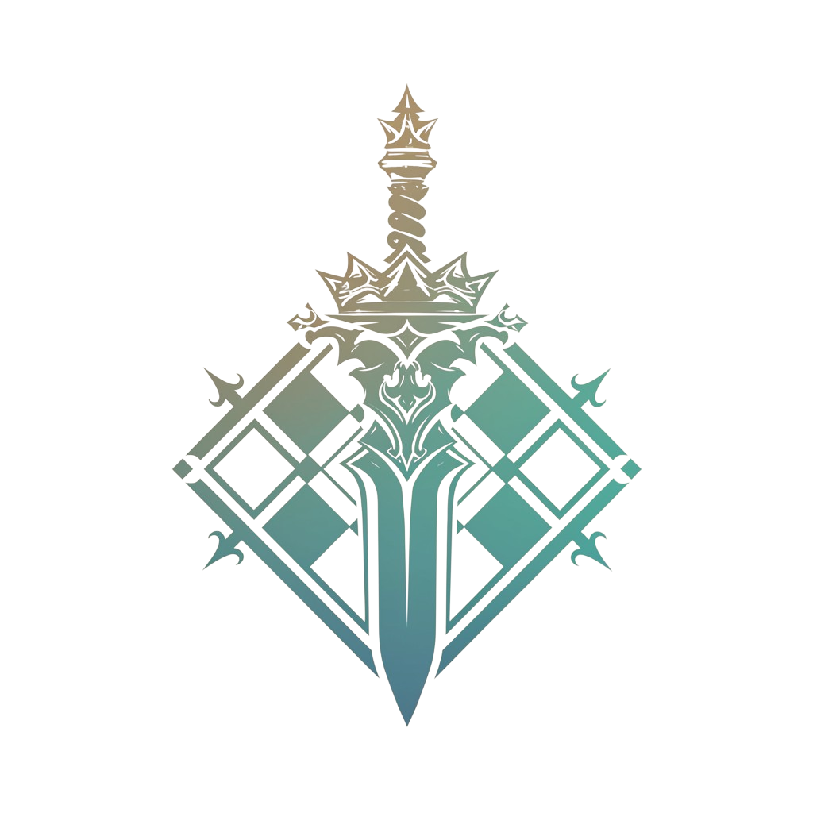

# Tellanos: Heroes of Seven Realms

<div align="center">



**泰拉诺斯大陆：七境英雄**

策略RPG / 文明建设 | Unity 6 (URP 2D)

---

[游戏概述](#游戏概述) | [七大文明](#七大文明) | [核心玩法](#核心玩法) | [技术架构](#技术架构) | [开发规范](#开发规范)

</div>

---

## 游戏概述

七大文明并立的奇幻世界，玩家选择文明、招募英雄、训练军队、研究魔法，收集"神之守护碎片"决定大陆命运。

在泰拉诺斯大陆上，七个风格迥异的文明各自发展，拥有独特的建筑、军队和魔法体系。玩家将扮演一位文明领袖，从一座城池起步，招募传奇英雄，训练精锐军队，探索未知领域，最终收集散落大陆的"神之守护碎片"，书写属于自己的史诗篇章。

---

## 七大文明

| 文明 | 代号 | 特色 |
|:----:|:----:|------|
| **阿拉伯** | `arb` | 沙漠商队与神秘的炼金术 |
| **埃及** | `egy` | 古老神殿与不朽法术 |
| **印度** | `ind` | 神圣象兵与业火魔法 |
| **希腊** | `grk` | 重装步兵与奥林匹斯之力 |
| **汉唐** | `han` | 弓骑兵团与五行道术 |
| **蒙古** | `mng` | 草原铁骑与萨满祝福 |
| **南岛** | `isl` | 海洋勇士与风暴召唤 |

---

## 核心玩法

### 文明建设
从一座主城开始，建造资源建筑、军事设施、魔法学院，发展独特的科技树。

### 英雄系统
招募来自不同文明的传奇英雄，每位英雄拥有独特的技能树和成长路线。

### 回合制战斗
六角格战场上的策略对决，地形、兵种、魔法相互克制，战术深度丰富。

### 探索冒险
探索大陆上的遗迹、洞穴、神殿，获取稀有资源和神之守护碎片。

---

## 技术架构

### 项目结构

```
Assets/
  src/                      # 源代码
    framework/              # 框架层 (GameEntry, EventSystem, Context)
    context/                # 游戏上下文 (Session, World, Battle)
    scene/                  # 场景控制器
    map/                    # 地图系统 (Tilemap + 逻辑分离)
  scenes/                   # 场景文件
    BootScene               # 启动场景
    MainMenuScene           # 主菜单
    WorldScene              # 世界地图
  docs/                     # 设计文档
  art/                      # 美术资源
  font/                     # 字体资源
```

### 上下文架构

采用分层上下文管理游戏生命周期，支持嵌套、并行、暂停/恢复：

```
RootContext (全局)
  └── SessionContext (存档会话: 玩家数据、天数、资源)
        ├── WorldContext (探索: 地图、英雄移动)
        └── BattleContext (战斗: 战场、回合、单位)
```

### 技术栈

- **引擎**: Unity 6000 (URP 2D)
- **动画**: DOTween
- **UI**: TextMeshPro
- **异步**: UniTask
- **资源**: Addressables

---

## 开发规范

### 代码风格

| 类型 | 风格 | 示例 |
|------|------|------|
| 命名空间 | PascalCase | `GameFramework` |
| 类/接口 | PascalCase | `GameEntry`, `IGameSystem` |
| 方法 | PascalCase | `OnInit`, `GetSystem` |
| 私有字段 | camelCase | `currentProcedure` |
| 常量 | ALL_CAPS | `MAX_UNIT_LEVEL` |

### 资源命名

```
美术: th7_[模块]_[文明]_[描述]_vXX.png
数据: th7_[类型]_[文明]_design.xlsx
```

### 编程偏好

- 禁用 emoji，代码简洁优先
- 少用 try-catch，优先逻辑判断
- 少用 switch-case，优先多态/字典映射
- 优先使用 Unity 内置功能和成熟方案
- 使用 C# 新特性（模式匹配、表达式体成员等）

---

## 相关文档

- [项目简介](project_brief.md) - 项目技术概览
- [游戏设计文档](docs/TH7_GameDesignDocument.md) - 完整游戏设计

---

<div align="center">

**TH7 Project** | Made with Unity

</div>

